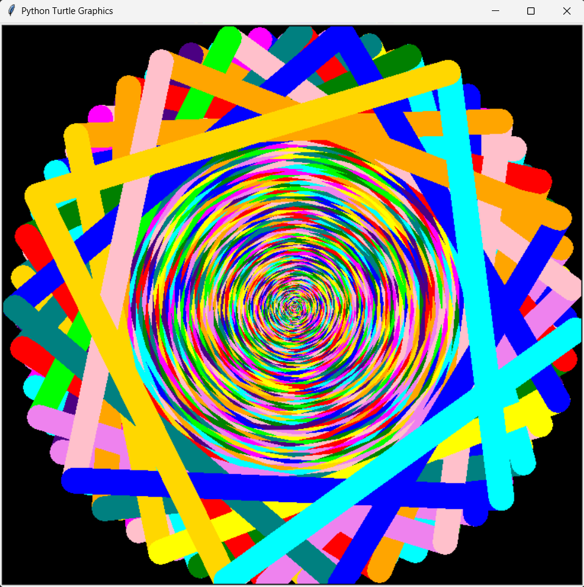
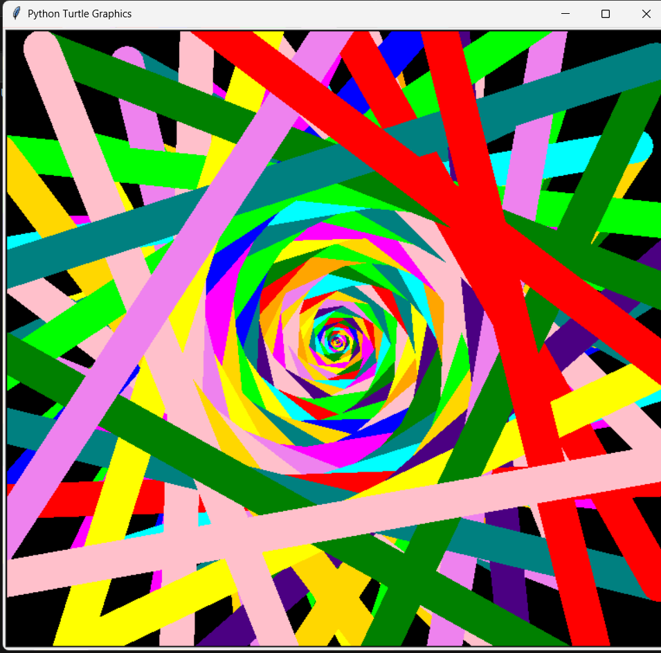
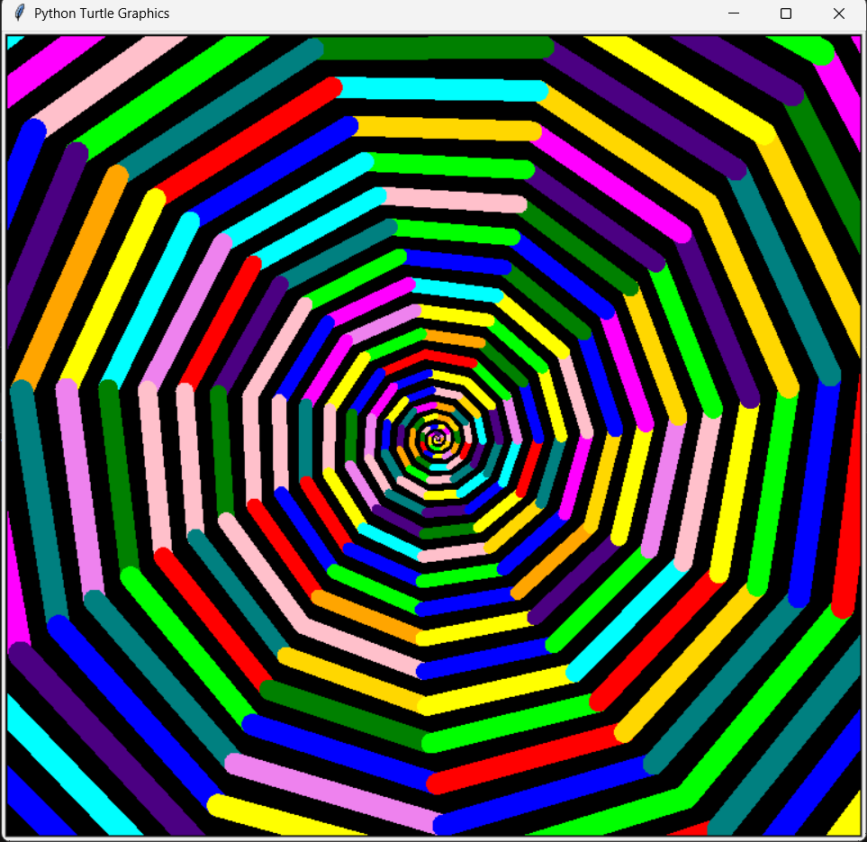
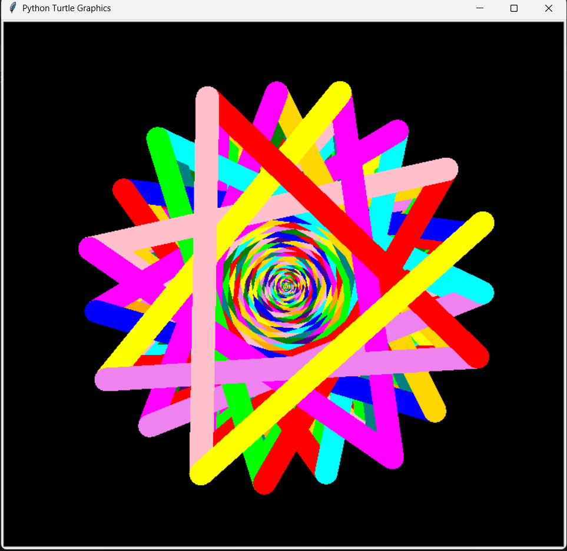
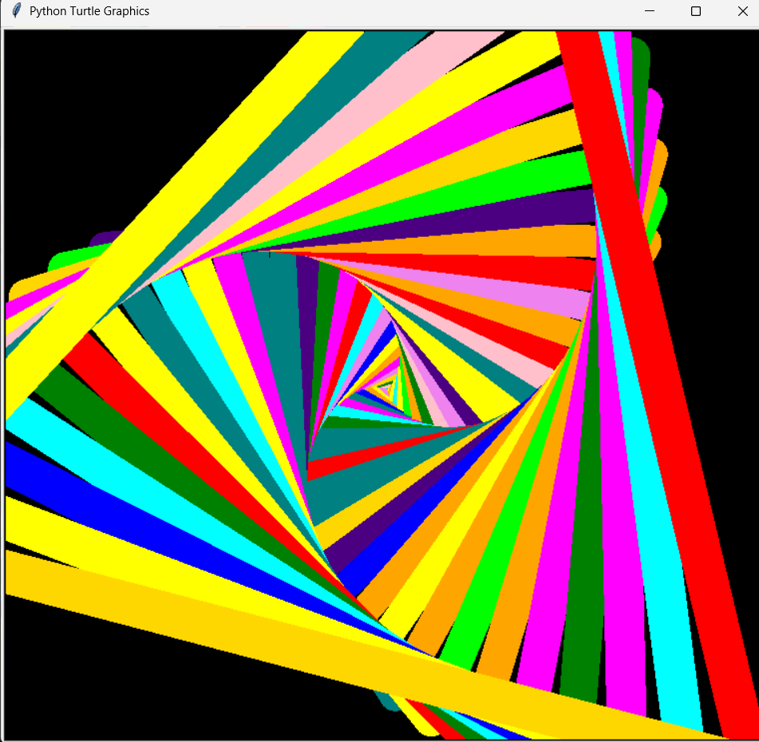

# spiral-generator

A parametric generative art tool built with Python and Turtle. Tweak a handful of numbers and get wildly different geometric art — from tight golden-angle sunflowers to exploding color wheels.











---

## Getting started

```bash
git clone https://github.com/arnavmer935/spiral-generator
cd spiral-generator
python drawing.py
```

No dependencies beyond the Python standard library. Runs on Python 3.10+.

---

## Parameters

| Parameter | Type | Default | Description |
|---|---|---|---|
| `length_limit` | float | 500 | Max stroke length before drawing stops |
| `length` | float | 0.00001 | Initial stroke length |
| `sample_size` | int | 3 | Colors per palette band |
| `thickness` | float | 0 | Initial stroke thickness |
| `initial_heading` | float | 0 | Starting direction of the turtle (degrees) |
| `rotation_angle` | float | 67 | Turn angle per step — the most visually impactful parameter |
| `growth_rate` | float | 0.1 | How fast stroke length and thickness grow per step |

---

## The beauty of `rotation angle`

This single parameter determines the geometry of the output:

| Angle | Shape |
|---|---|
| `120` | Equilateral triangle |
| `90` | Square |
| `72` | Pentagon |
| `45` | Octagon |
| `137.5` | Golden angle — sunflower |
| `181` | Near-straight line that fans into a color wheel |

Small deviations from these values (e.g. `91` instead of `90`) cause the geometry to slowly drift and rotate, producing hypnotic tunnel effects.

---

## Surprise me mode (upcoming!)

Don't want to think about parameters? Let the script pick randomly. Every run produces something completely different.

---

## Metrics

Each run prints performance stats to the console:

```
-------------METRICS----------------
Distance travelled: 116546.5918 pixels
Number of turns during drawing: 402
Average drawing speed: 2962.7077 px/s
```

---

## Roadmap

- [ ] Tkinter GUI with sliders for all parameters
- [ ] "Surprise me" button with live parameter display
- [ ] PNG/JPEG export
- [ ] Named presets (Golden, Octagon, Chaos, etc.)
